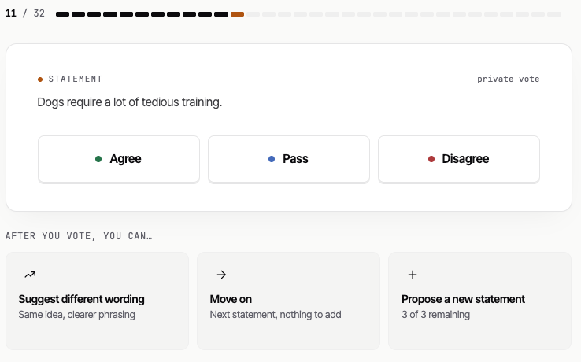
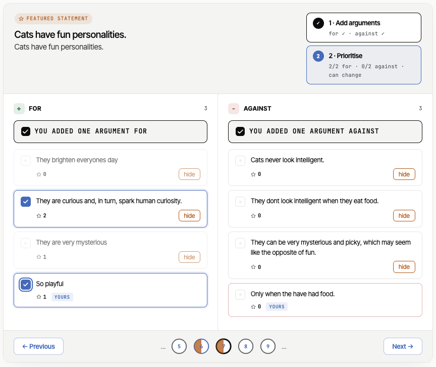
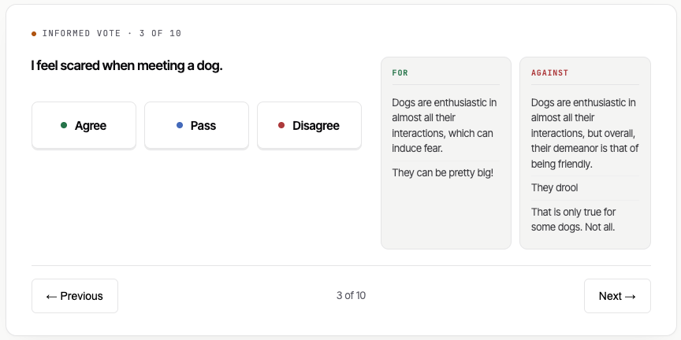

# Participant help

> **⚠️ AI-generated draft — not for publication.** Public-facing copy, drafted by an AI
> assistant from the repo's research synthesis and not yet reviewed for accuracy, tone,
> or accessibility. It is meant to be **delivered through the website/app**, not read
> from the repo. Verify the underlying sources before publishing (D-RESEARCH).

## What is this?

This is a conversation. You'll see short **statements** — claims about a topic — and vote
**Agree**, **Disagree**, or **Pass** on each. Your votes, together with everyone else's,
build a map of where the community stands. The goal isn't the most popular opinion — it's
to find the positions people across different viewpoints can agree on [1].

Your votes are private while the conversation is running — no one sees who voted what.
See the [privacy notice](../v2/pub_privacy.md).

## How to vote

- **Agree** — you think the statement is true or right.
- **Disagree** — you think it's false or wrong.
- **Pass** — you're not sure, it doesn't apply to you, or it's written so you can't vote
  clearly (for example, it bundles two claims and you agree with one but not the other).

You don't have to vote on everything. **Passing is fine** — and a Pass on a confusing or
two-in-one statement is useful signal in itself [1].

After you vote, you'll be offered a choice: suggest different wording for the statement you
just voted on, move on to the next one, or propose a new statement of your own.

<!-- SCREENSHOT TODO: the voting card — a single statement with the Agree / Disagree / Pass controls and the progress indicator. Drop the PNG at guidance/assets/phase-vote.png -->
*Voting: read each statement and choose Agree, Disagree, or Pass.*

## Suggesting different wording

If a statement's idea is right but its phrasing isn't, you can suggest a clearer or fairer
rewording right after voting on it. It has to stay close to the original idea — a rewording
that drifts too far is rejected as too dissimilar.

## Submitting a statement

Anyone can add a statement; yours is reviewed before others see it. Submitting your own
statement unlocks only after you've cast a number of votes (10 by default), and each
participant can submit only a handful (3 by default) — voting comes first. A good statement:

- Makes **one claim** — if you want to say two things, submit two statements.
- Is **neutral** — describe the situation, don't argue the conclusion; let others make up
  their own minds [2].
- Is **specific** — "things should be better" earns near-universal agreement and tells us
  nothing.
- Is a **claim, not a question** or a topic title.

*Bad:* "Wikipedia should require reliable sources and editors should disclose conflicts of interest." *(two claims — split them)*
*Bad:* "Shouldn't the Foundation be more transparent?" *(a question — rewrite as a claim)*
*Good:* "The Wikimedia Foundation should publish a detailed annual report on how discretionary grants are allocated."

<!-- SCREENSHOT TODO: the "propose a statement" composer open on the voting screen. Drop the PNG at guidance/assets/phase-submit-statement.png -->
*Submitting: add your own statement — it's reviewed before others see it.*

## Writing a good argument

Arguments aren't on every statement — only on the **featured statements** picked for the
argument-mapping phase (usually the ones that divided voters most). On those, you can add a
short argument explaining your reasoning. Arguments are read by other people; they don't
change the vote map. A good argument:

- **States its direction** — for or against.
- **Gives a reason**, not a restatement ("I agree because it's important" adds nothing).
- **Makes one point** — multiple reasons → multiple arguments.
- **Is specific** — name a mechanism, a consequence, or a precedent.
- **Engages with the claim**, not with other people.

*Bad:* "I disagree because this would be bad for the project." *(restates the vote)*
*Good:* "**Against:** this would hit new editors hardest — they're least likely to know the sourcing conventions and most likely to be put off by rejection."

<!-- SCREENSHOT TODO: the argument-mapping screen for a featured statement, showing the For / Against columns and the add/skip controls. Drop the PNG at guidance/assets/phase-argument-mapping.png -->
*Argument mapping: add or weigh reasons for and against the most divisive statements.*

## Seeing your results

Once enough people have voted, you can see how the community's opinions cluster and where
your own votes place you.

<!-- SCREENSHOT TODO: the participant's personal/results view (opinion groups + where the participant sits). Drop the PNG at guidance/assets/phase-personal-results.png -->
*Results: see the opinion groups and where your votes place you.*

## A second round: informed voting

Some conversations run a second voting round on a few key statements, this time with the
arguments shown alongside, so you can vote again after reading the reasoning.

<!-- SCREENSHOT TODO: the informed-voting (Phase 6) screen — a featured statement with its for/against arguments inline and Agree/Disagree/Pass. Drop the PNG at guidance/assets/phase-informed-voting.png -->
*Informed voting: vote again on key statements with the arguments in view.*

## Final results

When the conversation closes, the published results show what the community agreed on.

<!-- SCREENSHOT TODO: the public/final results page of a closed conversation. Drop the PNG at guidance/assets/phase-public-results.png -->
*Final results: the published outcome once the conversation has closed.*

---

*Based on the repo's research synthesis — participant copy [`research/05`](../docs/research/05-website-copy.md), statements [`research/02`](../docs/research/02-statement-writing-guide.md), arguments [`research/04`](../docs/research/04-arguments.md).*

## References

> External sources; claims not independently re-verified before publication.

1. Small et al. (2021), "Polis: Scaling Deliberation by Mapping High Dimensional Opinion Spaces," *RECERCA* 26(2). <https://gwern.net/doc/sociology/2021-small.pdf>
2. Open Rights Group & Demos (2020–21), "Democratic Innovations: Polis and the Political Process." <https://www.openrightsgroup.org/publications/democratic-innovations-polis-and-the-political-process/>
